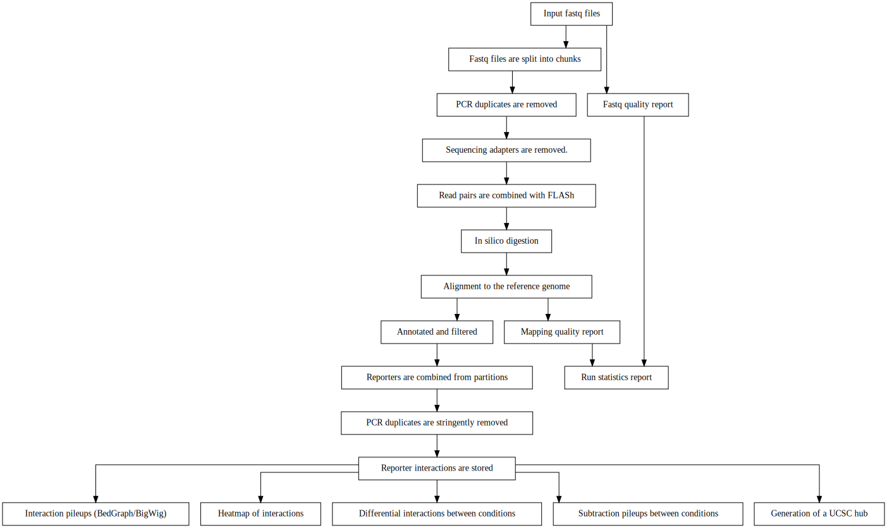

************************************
CapCruncher Data Processing Pipeline
************************************

The main feature of CapCruncher is the end-to-end data processing pipeline.
The pipeline has been written using the `cgat-core workflow management system <https://github.com/cgat-developers/cgat-core>`_
and the following diagram illustrates the steps performed by the pipeline:

This section provides further details on how to run the pipeline. In essence
the pipeline requires a working directory with correctly named FASTQ files
and a :ref:`config.yml <Step 2 - Edit a copy of config.yml>` file that provides
the pipeline configuration.

Configuration
#############

Step 1 - Create a working directory
***********************************

To run the pipeline you will need to create a working directory for the pipeline run::

   mkdir RS411_EPZ5676/
   cd RS411_EPZ5676/

The pipeline will be executed here and all files will be generated
in this directory.

Step 2 - Edit a copy of config.yml
**********************************

The configuration file `config.yml <https://github.com/sims-lab/capture-c/blob/master/config.yml>`_ enables
parameterisation of the pipeline run with user and run specific settings. This file also provides paths
to essential files for the pipeline run (e.g. aligner indices).

The paths supplied do not have to be in the same directory as the pipeline.

.. warning::

    The config file must be named **config.yml** to be recognised by the pipeline.

A copy of config.yml can be downloaded from GitHub using::

    wget https://raw.githubusercontent.com/sims-lab/capture-c/master/config.yml

This `yaml <https://yaml.org/spec/1.2/spec.html>`_ file can be edited using standard text editors e.g.::

    # To use gedit
    gedit config.yml

    # To use nano
    nano config.yml

Step 3 -  Copy or link FASTQ files into the :term:`working directory`
*********************************************************************

The pipeline requires that FASTQ files are paired and in any of these formats:

Here is an example of file pairing for two samples:

.. note::

    Multi-lane FASTQ files should be concatenated prior to running the pipeline

* samplename1_R1.fastq.gz
* samplename1_R2.fastq.gz
* samplename2_1.fastq
* samplename2_2.fastq

All FASTQ files present in the directory will be processed by the pipeline in parallel and
original FASTQ files will not be modified. If new FASTQ files are added to a pre-run pipeline,
only the new files will be processed.

Copy::

    cp PATH_TO_FASTQ/example_R1.fastq.gz.

Symlink example:

.. warning::
    Be sure to use the absolute path for symlinks

::

    ln -s /ABSOLUTE_PATH_TO_FASTQ/example_R1.fastq.gz

Step 4 - Running the pipeline
*****************************

After copying/linking FASTQ files into the working directory and configuring the copy of
`config.yml <https://github.com/sims-lab/capture-c/blob/master/config.yml>`_
in the working directory for the current experiment, the pipeline can be run with:

::

    capcruncher pipeline

There are several options to visualise which tasks will be performed by the pipeline
before running.

The tasks to be performed can be examined with:

::

    # Shows the tasks to be performed
    capcruncher pipeline show

    # Plots a directed graph using graphviz
    capcruncher pipeline plot

If you are happy with the tasks to be performed, the full pipeline run can be launched with:

::

    # If using all default settings and using a cluster
    capcruncher pipeline make

    # If not using a cluster, run in local mode.
    capcruncher pipeline make --local -p 4

    # Avoiding network disconnections
    nohup capcruncher pipeline make &

See `cgat-core Read the Docs <https://cgat-core.readthedocs.io/en/latest/getting_started/Examples.html>`_ for additional
information.

Step 5 - Running the pipeline to a specified stage
**************************************************

There are currently multiple stopping points built into the pipeline at key stages. These are:

* :literal:`fastq_preprocessing` - Stops after *in silico* digestion of FASTQ files.
* :literal:`pre_annotation` - Stops before aligned slices are ready to be annotated.
* :literal:`post_annotation` - Stops after aligned slices have been annotated.
* :literal:`post_capcruncher_analysis` - Stops after reporters have been identified and duplicate filtered.
* :literal:`plotting` - Stops after plotting has been performed. **Requires** plotting dependencies, see :ref:`installing optional packages<Installing optional packages>`
* :literal:`full` - Run the pipeline until all required tasks are complete.

To run the pipeline until one of these stopping points, use:

::

    # Run until TASK_NAME step
    capcruncher pipeline make TASK_NAME

    # e.g. to run the full pipeline
    capcruncher pipeline make fastq_preprocessing

Results
#######

The pipeline generates several key outputs:

Statistics for the pipeline run
*******************************

The *capcruncher_statistics/* folder contains all of the relevant statistics
for the pipeline run, an aggregated summary of all run statistics can be found in
*capcruncher_statistics/capcruncher_statistics.html*. An example can be found `here <_static/capcruncher_statistics.html>`_.

Reporters for each sample aggregated by viewpoint
*************************************************

All reporters can be found in the *capcruncher_anlysis/reporters* folder. Reporters are stored as:

1) TSV files (gzipped) containing all filtered reporter slices, aggregated by sample and viewpoint.
2) `Cooler format <https://cooler.readthedocs.io/en/latest/>`_ HDF5 files with all viewpoints per sample aggregated into the same file.

.. note::
    The Cooler format HDF5 files enable efficient genome wide queries and are compatible with tools using the Cooler ecosystem.

    Unlike Hi-C, Capture-C/Tri-C and Tiled-C experiments can contain multiple viewpoints. To facilitate efficient access to a specific viewpoint, the HDF5 files produced by CapCruncher
    contain a Cooler group for each viewpoint.

    To be compatible with tools in the cooler ecosystem the correct Cooler group must be specified (e.g. SAMPLENAME.hdf5::VIEWPOINT).

    The pre-binned matrix for each viewpoint (the bin size is specified by config.yml)
    can be found within the resolutions group (e.g. SAMPLENAME.hdf5::VIEWPOINT/resolutions/SPECIFIED_RESOLUTION).

    The Cooler package can be used to extract the reporter counts table/matrix for use in other applications::

        # See which viewpoints/resolutions are present
        cooler ls SAMPLENAME.hdf5

        # Extract reporter counts stored by restriction fragment
        cooler dump SAMPLENAME.hdf5::VIEWPOINT

        # Extract reporter counts stored in genomic bins
        cooler dump SAMPLENAME.hdf5::VIEWPOINT/resolutions/SPECIFIED_RESOLUTION

        # Extract reporter counts matrix for a specific region
        cooler dump SAMPLENAME.hdf5::VIEWPOINT -r chr1:1000-2000

BigWig files for each viewpoint/sample combination
**************************************************

BigWig files for each replicate/viewpoint combination can be found in *capcruncher_analysis/bigwigs/*. The BigWig files generated either contain raw reporter counts (e.g. SAMPLENAME.raw.VIEWPOINT.bigWig)
or are normalised (e.g. SAMPLENAME.normalised.VIEWPOINT.bigWig) by the number of cis reporters and adjusted by a scaling factor (default 1000000).

Summary BigWig files for each viewpoint/sample combination
**********************************************************
Summary BigWig files can also be found in *capcruncher_analysis/bigwigs/*. Different replicate aggregations e.g. median, sum can be performed by altering the summary_methods entry within the plot section of config.yml.
Replicates will be grouped together using:

Pattern matching
""""""""""""""""

This occurs if a design matrix has not been supplied to config.yml. In this case it is crucial that the correct sample naming scheme has been followed i.e.:

| CONDITION-A_REPLICATE-IDENTIFIER_READNUMBER.fastq.gz
| CONDITION-B_REPLICATE-IDENTIFIER_READNUMBER.fastq

| e.g.
| RS411-DMSO_1_1.fastq
| RS411-DMSO_1_2.fastq
| RS411-DMSO_2_1.fastq
| RS411-DMSO_2_2.fastq
| RS411-DMSO_3_1.fastq
| RS411-DMSO_3_2.fastq
| RS411-EPZ5676_1_1.fastq.gz
| RS411-EPZ5676_1_2.fastq.gz
| RS411-EPZ5676_2_1.fastq.gz
| RS411-EPZ5676_2_2.fastq.gz
| RS411-EPZ5676_3_1.fastq.gz
| RS411-EPZ5676_3_2.fastq.gz

Design Matrix
"""""""""""""

Replicate aggregation can also be performed using a design matrix (TSV format) supplied to config.yml (analysis_design_matrix). The design matrix should look something like this e.g.:

.. csv-table:: Example design matrix
    :header: "sample", "condition"
    :widths: 20, 20

    "SAMPLE-A_1", "CONDITION_A"
    "SAMPLE-A_2", "CONDITION_A"
    "SAMPLE-A_3", "CONDITION_A"
    "SAMPLE-B_1", "CONDITION_B"
    "SAMPLE-B_2", "CONDITION_B"
    "SAMPLE-B_3", "CONDITION_B"

.. note::
    Do not include the read number or the .fastq(.gz) extension in the sample name.

UCSC hub
********

The UCSC hub generated by the CapCruncher pipeline contains:

* BigWigs for each replicate/viewpoint combination
* BigWigs for each condition/viewpoint combination
* Subtraction BigWigs for each condition
* Viewpoints used
* Run statistics

The UCSC hub can be found in the directory specified by hub_dir in config.yml. To view the hub on UCSC
move/upload the hub to a publically accessible location and paste the address into the UCSC Genome Browser
track hub “My hubs” tab.
